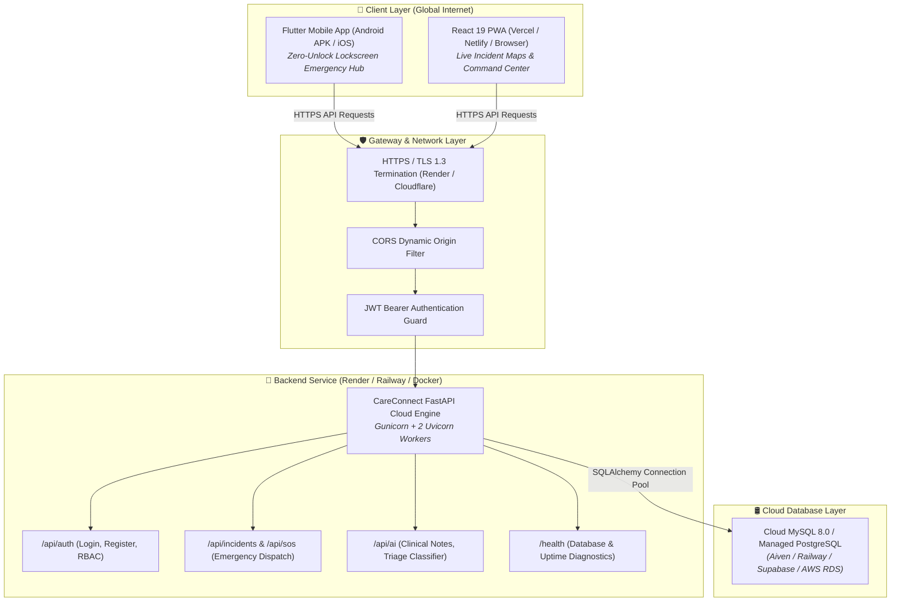

# CareConnect 🏥
### Community Emergency Response & Assistance Network

[](https://github.com/asishpaleti2710-code/Care_Connect/actions/workflows/ci-cd.yml)
[](https://fastapi.tiangolo.com/)
[](https://flutter.dev/)
[](https://react.dev/)
[](https://www.python.org/)
[](https://www.mysql.com/)
[](LICENSE)

**CareConnect** is a state-of-the-art, cross-platform community emergency response and caregiving network. Designed to seamlessly connect residents, caregivers, family guardians, community volunteers, security responders, and administrative directors, CareConnect delivers real-time emergency dispatches, zero-unlock mobile lock screen controls, interactive GPS maps, and AI-assisted clinical triage.

---

## 🚀 1-Click Cloud Deployment

Deploy your own live online instance of CareConnect in minutes:

[](https://render.com/deploy?repo=https://github.com/asishpaleti2710-code/Care_Connect)
[](https://vercel.com/new/clone?repository-url=https://github.com/asishpaleti2710-code/Care_Connect&root-directory=frontend)

> 📖 **Full Deployment Manual**: Check [DEPLOYMENT_GUIDE.md](DEPLOYMENT_GUIDE.md) for step-by-step instructions for Render, Railway, Cloud MySQL (Aiven), and mobile APK release.

---

## 🌐 Production & Online URLs

- **Production Cloud Backend API**: `https://careconnect-backend.onrender.com`
- **Interactive Cloud API Docs**: `https://careconnect-backend.onrender.com/docs`
- **System Health Diagnostics**: `https://careconnect-backend.onrender.com/health`
- **Web Frontend (Vercel/PWA)**: `https://careconnect-app.vercel.app`
- **Local Dev Web App**: `http://localhost:5173`
- **Local Dev Backend API**: `http://localhost:8000`

---

## 📱 Mobile Lock Screen Emergency Hub (Zero-Unlock Mode)

CareConnect features a dedicated **Mobile Lock Screen Emergency Hub** (`CareConnect-Flutter`) engineered for instant emergency dispatch without needing to unlock the phone:

1. **Direct Lock Screen Display (`showWhenLocked="true"`)**: Displays the high-urgency SOS interface over Android keyguards.
2. **1-Tap Glowing SOS Button**: Fast pulse emergency trigger with 3-second abort safety countdown.
3. **Paramedic Medical ID**: Blood Group (`O+`), Allergies (`Penicillin`), and Primary Guardian details visible to first responders without PIN/biometrics.
4. **Audio-Visual Strobe Beacon**: Flashes the screen in high-contrast red/white and sounds siren alarms to signal location.
5. **Speed Dial Shortcuts**: Immediate 1-touch calls for `911 / 112` and primary guardian line.
6. **Online Cloud Sync**: Real-time cloud dispatch with offline SMS / mesh fallback.

---

## ✨ Specialized Role Portals

| Portal | Target Role | Key Capabilities |
| :--- | :--- | :--- |
| 🚨 **Resident SOS** | Senior Residents / Patients | One-tap emergency SOS triggering, real-time dispatch tracking, medical history profile, emergency contact management, and AI risk classifier. |
| 🛡️ **Responders & Security** | Security, Police, EMTs, Volunteers | Real-time emergency incident feed, one-click incident acceptance, turn-by-turn Leaflet/OSRM map navigation, and incident status progression (`Accepted` ➔ `En Route` ➔ `Resolved`). |
| 💓 **Neighbor Network** | Community Neighbors & Volunteers | Community-based emergency alert network enabling nearby neighbors to accept and provide immediate assistance before official emergency services arrive. |
| 📞 **Guardians** | Family Members / Next of Kin | Continuous peace-of-mind monitoring, live emergency alert notifications when a ward triggers an SOS, and direct caregiver contact details. |
| 📋 **Caregiver Roster** | Caregivers / Nurses | Daily resident care roster, vital sensor telemetry monitoring (heart rate, fall detection), medication logs, and AI-assisted medical note analysis. |
| 📊 **Admin Analytics** | System Admins / Directors | Executive command center, system-wide dispatch override, response time analytics, resident/guardian directory management, and full access to **all sub-portals**. |

---

## 🏗️ System Architecture



---

## 🛠️ Local Development & Quick Start

### 1. Backend Service
```bash
cd backend
python -m venv venv
# Windows:
.\venv\Scripts\activate
# Linux/macOS:
source venv/bin/activate

pip install -r requirements.txt
python -m uvicorn app.main:app --host 0.0.0.0 --port 8000 --reload
```

### 2. Frontend Web Application
```bash
cd frontend
npm install
npm run dev
```

### 3. Flutter Mobile Application
```bash
cd ../CareConnect-Flutter
flutter pub get
flutter run
```

---

## 📄 License
This project is licensed under the MIT License - see the [LICENSE](LICENSE) file for details.
